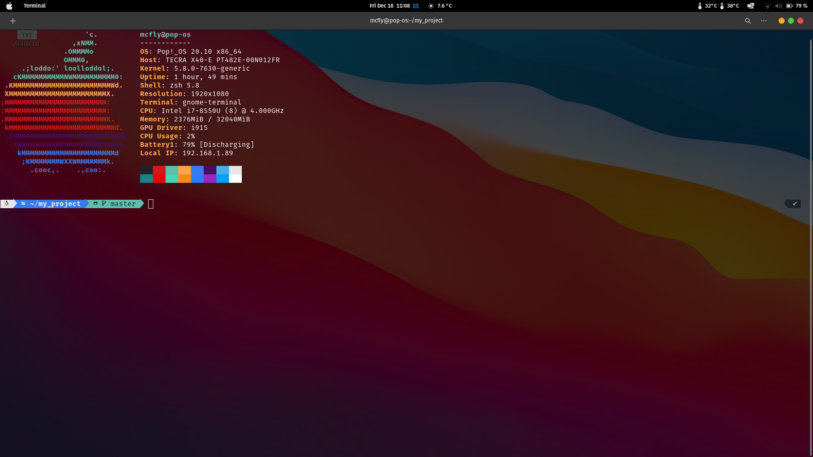

## INTRODUCTION 

Hello my name is Matthieu Roman and i'm a french student and there is my work. 

If you have any questions, or if there are mistakes, please let me know.

My Discord is **Marty McFly#2955** you can contact me on it

## The game 

The game is simple, you have to find the right number between 1 and 100.

### Prerequisites

- First of all you need a unix operating system like : macOS or Linux.
- [Git](https://doc.ubuntu-fr.org/git) must be installed ! 
- That's all ! 

### Setup 

At first, you need to __clone the project.__

Open your [**terminal**](https://doc.ubuntu-fr.org/terminal) and run this command : 

| Method         | Command                                                                                           |
|:---------------|:--------------------------------------------------------------------------------------------------|
| **git clone**  | `git clone https://github.com/M4Hacker/git-tutorial`                                              | 

Once in the folder git-project you have to run this : 

```./guessing_game.py ```

**Enjoy 🎉**

## Contributors

- Matthieu Roman <matthieu.roman@edu.devinci.fr>

## License & Copyright 

© Matthieu Roman - **Linux | ESILV**

## Images 

And here, there are few images of my environment which i personalized


